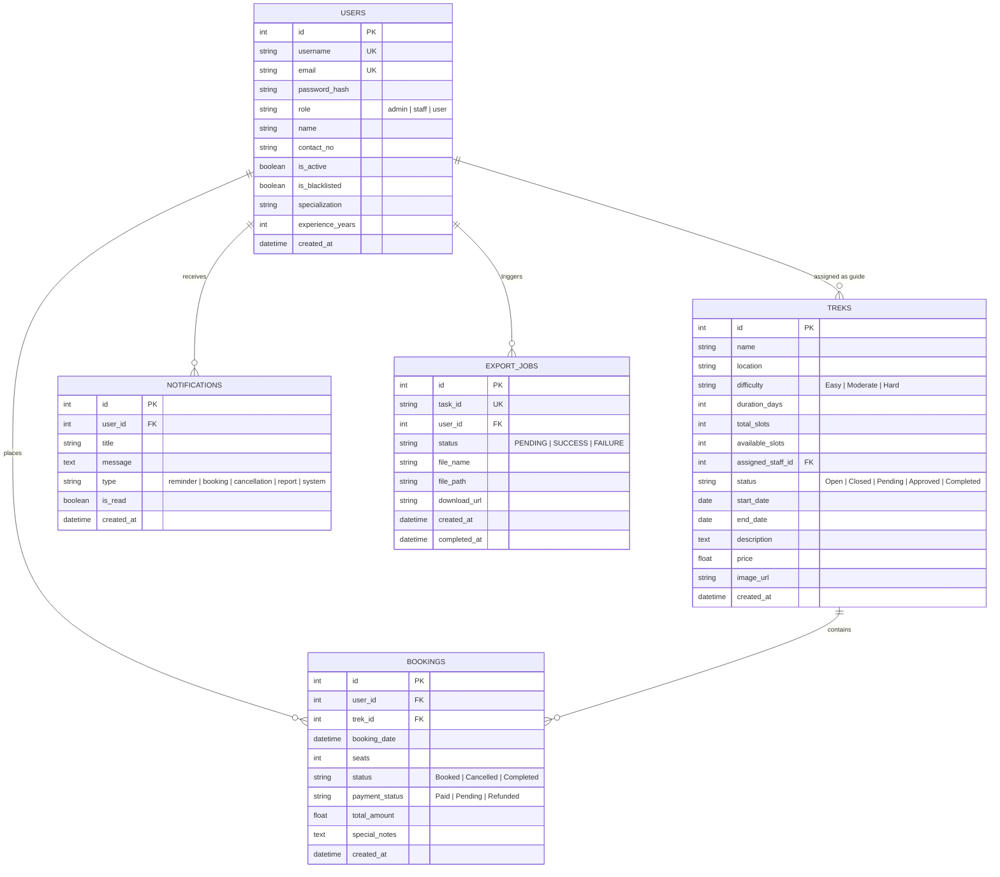

# Trekking Management Application (TMA - V2)
**Modern Application Development 2 (MAD 2) Project**

---

## 🌟 Executive Summary
The **Trekking Management Application (TMA - V2)** is a full-stack, enterprise-grade web application designed for adventure travel organizations to seamlessly coordinate trekking activities, participant registrations, slot allocations, guide assignments, and automated report generation across three distinct roles:
1. **Admin (Superuser)**: Complete control over trek routes, staff onboarding and assignments, user moderation, analytics charts, and monthly activity reports.
2. **Trek Staff (Guides)**: Management of assigned trek routes, real-time slot adjustments, operational statuses (`Open`, `Closed`, `Started`, `Completed`), and live participant rosters.
3. **User (Trekker)**: Self-registration, multi-filter search, instant booking with slot validations, trekking history review, and asynchronous CSV export.

---

## 🛠️ Mandatory Tech Stack Adherence

| Layer | Framework / Library | Specification Compliance |
| :--- | :--- | :--- |
| **API Backend** | **Flask (Python 3.x)** | RESTful API with Flask-SQLAlchemy, Flask-JWT-Extended, and Flask-Cors |
| **User Interface** | **Vue.js 3** | Single-Page Application with Vue Router, Reactive Store, and Axios |
| **CSS Framework** | **Bootstrap 5 & Icons** | Responsive UI for mobile & desktop (Strictly no other CSS framework used) |
| **Database** | **SQLite (SQLAlchemy)** | Programmatic table creation & pre-existing Admin seeding |
| **Performance & Caching** | **Redis & Flask-Caching** | Redis caching for frequently accessed treks with cache invalidation |
| **Background / Batch Jobs** | **Celery & Redis** | Scheduled Daily Reminders, Monthly PDF/HTML Reports, and Async CSV Exports |
| **Analytics & Visuals** | **Chart.js** | Interactive charts for difficulty distribution and popular trek bookings |
| **Document Generation** | **ReportLab** | PDF generation for Monthly Activity Reports |

---

## 🔑 Default Credentials for Evaluation

| Role | Username / Email | Password | Access & Responsibilities |
| :--- | :--- | :--- | :--- |
| **Superuser Admin** | `admin@trekma.com` (or `admin`) | `Admin@123` | Pre-existing superuser. Full system management, analytics, staff onboarding, moderation. |
| **Trek Staff (Guide 1)** | `alex@trekma.com` (or `staff_alex`) | `Staff@123` | High Altitude Alpine Specialist. Manages assigned treks & participant rosters. |
| **Trek Staff (Guide 2)** | `priya@trekma.com` (or `staff_priya`) | `Staff@123` | Western Ghats Rainforest Specialist. |
| **Trek Staff (Guide 3)** | `rohit@trekma.com` (or `staff_rohit`) | `Staff@123` | Himalayan Passes & Navigation Leader. |
| **Trekker (User 1)** | `john@example.com` (or `trekker_john`) | `User@123` | Sample registered trekker with active bookings and history. |
| **Trekker (User 2)** | `sara@example.com` (or `trekker_sara`) | `User@123` | Sample registered trekker. |

> *Note: A 1-Click Quick Demo Login panel is built into the login page for effortless switching between roles during grading.*

---

## 🗄️ Database Architecture & ER Diagram



---

## 🚀 Running the Application Locally

### Prerequisites
- Python 3.10+ (Tested on Python 3.14)
- Node.js 18+ and npm
- (Optional for Celery & Redis): Redis Server running on `localhost:6379` (App automatically provides fallback for standalone execution).

---

### Step 1: Start the Flask Backend
Open a terminal in the `backend/` folder:
```powershell
cd backend
# Activate virtual environment
.\venv\Scripts\Activate.ps1   # On Windows PowerShell
# Or .\venv\Scripts\activate.bat on CMD

# Run Flask server (auto-creates SQLite db and seeds sample data)
python app.py
```
> The Backend REST API will start at **`http://127.0.0.1:5000`**.

---

### Step 2: Start the Vue.js Frontend
Open a second terminal in the `frontend/` folder:
```powershell
cd frontend
npm run dev
```
> The Vue.js single page application will be available at **`http://localhost:5173`**.

---

### Step 3: Run Background Jobs & Celery (Optional / For Batch Tasks)
To run Celery worker and scheduler in separate terminals:
```powershell
# Terminal 3: Celery Worker
cd backend
.\venv\Scripts\celery -A celery_app.celery_app worker --loglevel=info -P solo

# Terminal 4: Celery Beat Scheduler (Scheduled daily & monthly jobs)
cd backend
.\venv\Scripts\celery -A celery_app.celery_app beat --loglevel=info
```

---

## 📡 API Resource Endpoints

### 🔐 Authentication & Profile (`/api/auth`)
- `POST /api/auth/register` - Trekker self-registration (Trekkers only)
- `POST /api/auth/login` - Unified JWT login for Admin, Staff, and Trekkers
- `GET /api/auth/me` - Retrieve current user profile
- `PUT /api/auth/me` - Update profile information
- `POST /api/auth/change-password` - Update password

### 🏔️ Trek Routes & Catalog (`/api/treks`)
- `GET /api/treks` - List & multi-filter treks (Redis cached with TTL)
- `GET /api/treks/<id>` - Retrieve detailed single trek
- `POST /api/treks` - Admin creates new trek route
- `PUT /api/treks/<id>` - Admin/Staff updates trek slots or details
- `DELETE /api/treks/<id>` - Admin removes trek

### 👑 Admin Management (`/api/admin`)
- `GET /api/admin/stats` - Analytics metrics & Chart.js statistics
- `GET /api/admin/staff` - List all staff & assigned routes
- `POST /api/admin/staff` - Admin creates/onboards staff account
- `GET /api/admin/users` - Search & view all users and staff
- `PUT /api/admin/users/<id>/status` - Toggle active status or blacklist
- `POST /api/admin/assign-staff` - Assign/reassign staff member to trek
- `GET /api/admin/bookings` - View all historical bookings

### 👥 Staff Operations (`/api/staff`)
- `GET /api/staff/treks` - List treks assigned to current guide
- `GET /api/staff/treks/<id>/participants` - View participant roster for assigned trek
- `PUT /api/staff/treks/<id>/status` - Update operational slots and trek status

### 🎫 Bookings (`/api/bookings`)
- `POST /api/bookings` - User books available open trek (validates slots, prevents duplicates)
- `GET /api/bookings/my-bookings` - View active user bookings
- `GET /api/bookings/history` - View past completed/cancelled bookings
- `POST /api/bookings/<id>/cancel` - Cancel booking & restore trek slots

### 📊 Reports & Notifications (`/api/reports`)
- `POST /api/reports/trigger-export` - Async Celery task to export booking history as CSV
- `GET /api/reports/export-status/<task_id>` - Check export job status
- `GET /api/reports/my-exports` - List user's generated CSV files
- `GET /api/reports/download-export/<filename>` - Download exported CSV file
- `POST /api/reports/generate-monthly-report` - Generate HTML/PDF monthly report
- `GET /api/reports/monthly-reports` - List available monthly activity reports
- `GET /api/reports/download-monthly/<filename>` - View/Download PDF or HTML report
- `POST /api/reports/trigger-daily-reminders` - Run daily reminder background job
- `GET /api/reports/notifications` - Get user notifications & alerts
- `PUT /api/reports/notifications/<id>/read` - Mark notification as read
- `PUT /api/reports/notifications/read-all` - Mark all notifications as read

---

## 🧪 Automated Testing
Run the comprehensive unit test suite covering auth, caching, slot validation, RBAC, and Celery jobs:
```powershell
cd backend
.\venv\Scripts\python test_api.py
```
Expected output:
```
[PASS] Health check endpoint OK
[PASS] Superuser Admin login OK
[PASS] Trek Staff login OK
[PASS] Trekker self-registration OK
[PASS] Trek search, filter, and Redis caching OK
[PASS] Booking flow, slot decrement, duplicate check, and cancellation refund OK
[PASS] Admin analytics and user moderation endpoints OK
[PASS] Celery tasks (Daily reminders, Monthly PDF/HTML report, Async CSV Export) OK
Ran 8 tests - OK
```
